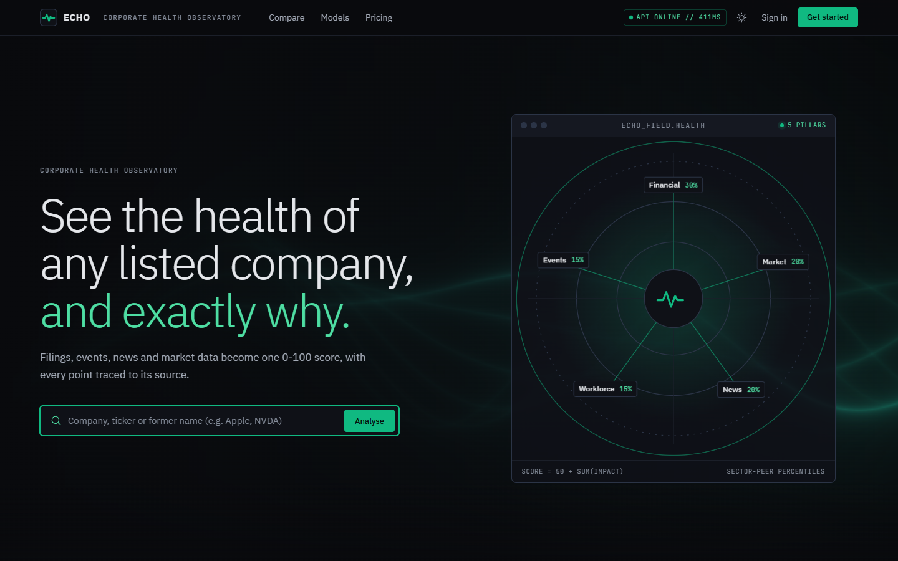
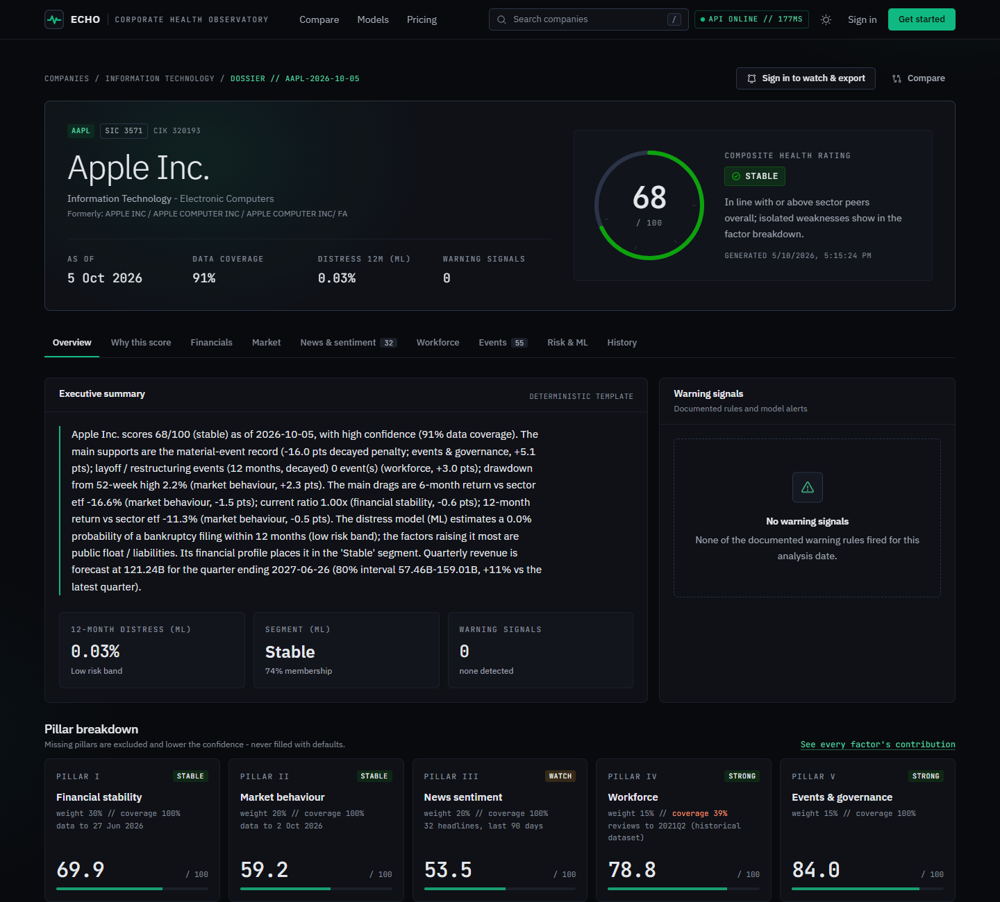
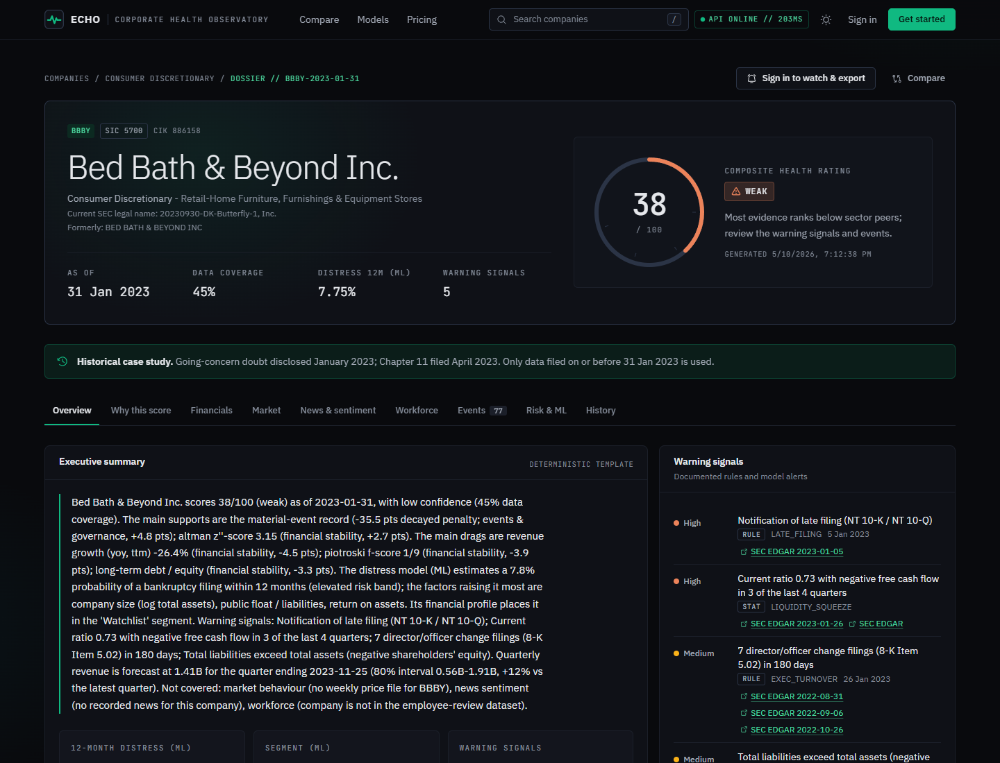
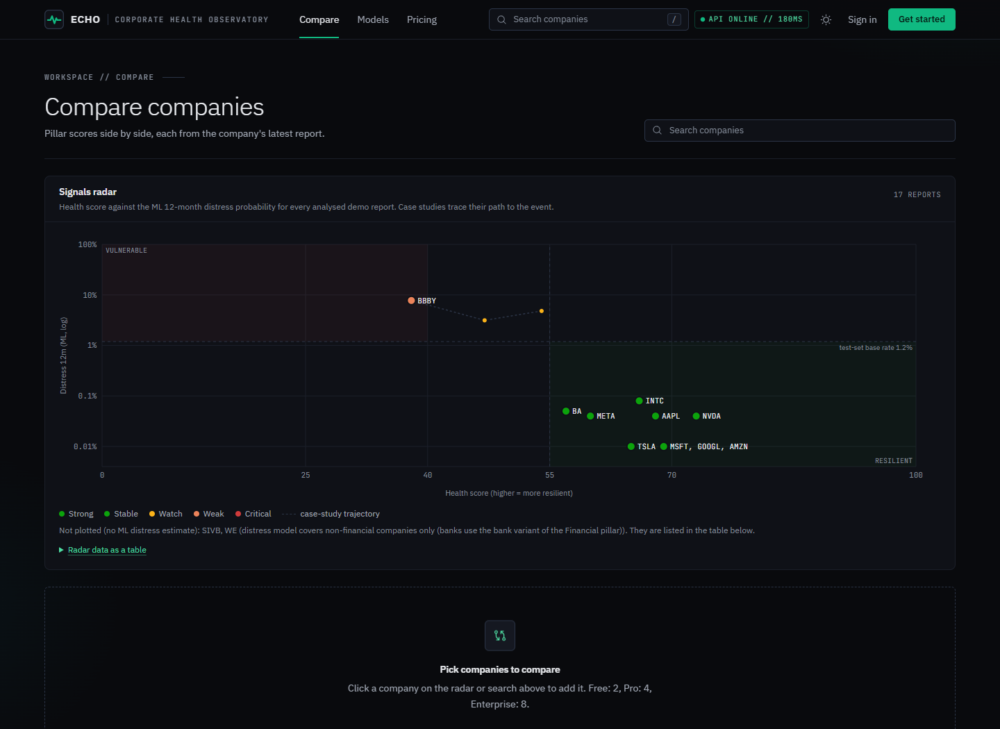
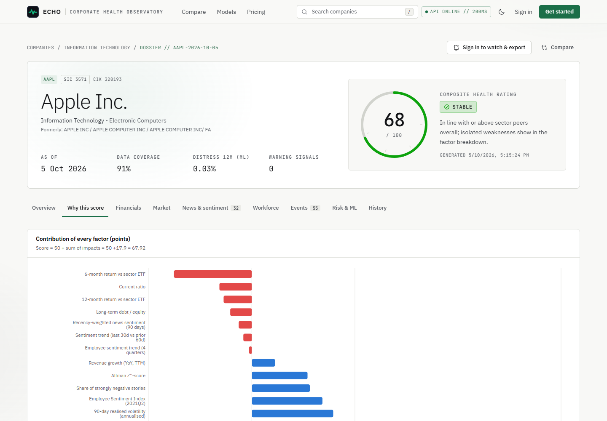
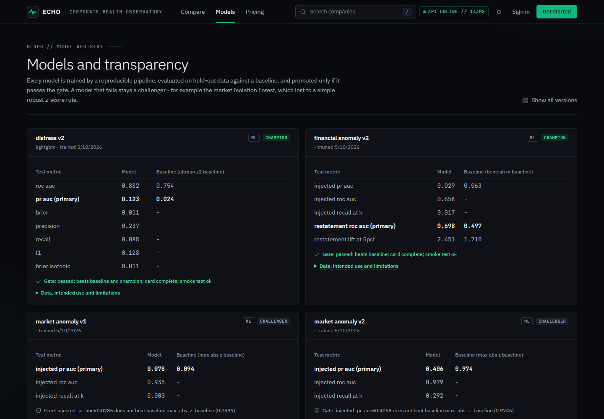
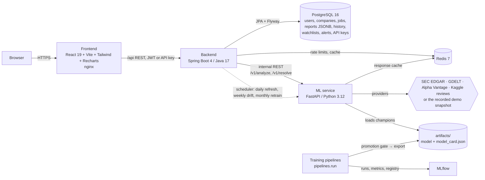

# ECHO — Enterprise Corporate Health Observatory

AI/ML-powered corporate intelligence and early-warning platform. Enter a company name; ECHO combines
public **SEC filings (XBRL financials + 8-K events)**, **news headlines**, **market data** and **employee
sentiment** into an explainable **0–100 Corporate Health Score**, a calibrated **12-month distress
probability**, anomaly alerts, forecasts and an executive summary in which every point traces back to a
source.

> ECHO reports observable public signals and model estimates. It is **not financial advice** and does not
> predict with certainty whether a company will succeed or fail.

| | |
|---|---|
| **Academic report** | [docs/report/REPORT.md](docs/report/REPORT.md) — problem, data, methods, results, limitations, references |
| **Viva guide** | [docs/viva/VIVA.md](docs/viva/VIVA.md) — demo script and likely questions with answers |
| **Design docs** | [Architecture](docs/architecture/ARCHITECTURE.md) · [Data strategy](docs/architecture/DATA_STRATEGY.md) · [ML pipeline](docs/architecture/ML_PIPELINE.md) · [Scoring](docs/architecture/SCORING.md) · [Roadmap](docs/architecture/BUILD_PLAN.md) |
| **API** | [docs/api/API.md](docs/api/API.md) · live OpenAPI at `http://localhost:8080/api/swagger-ui` |
| **Product** | [docs/product/PRODUCT.md](docs/product/PRODUCT.md) — plans, monetisation, roadmap |
| **UI design** | [docs/design/DESIGN.md](docs/design/DESIGN.md) — "Institutional Intelligence" system from the Google Stitch concept |

## Screenshots

| | |
|---|---|
|  |  |
| Landing (dark terminal theme, WebGL hero) | Company dossier: score, band, coverage, distress estimate |
|  |  |
| Case study: BBBY as of 31 Jan 2023, using only data filed by then | Signals radar: health score vs ML distress probability, with case-study trajectories |
|  |  |
| "Why this score": exact additive attribution (light theme) | Model registry: each champion vs its baseline |

## Architecture



Request flow: the frontend asks the backend for a report → if there is no fresh report the backend
creates an **async analysis job** (one per company/date, enforced by a DB index) and returns `202` → a
worker calls the ML service, which fetches data, builds **point-in-time** features, runs the models,
scores, explains and returns one versioned `AnalysisResult` → the backend stores it as a JSONB report plus
score-history points and raises watchlist alerts → the frontend, which was polling the job, renders it.

## Technology stack

| Layer | Technologies |
|---|---|
| Frontend | React 19, Vite 8, Tailwind CSS 4, Recharts 3, TanStack Query 5, React Router 7, Vitest + Testing Library |
| Backend | Java 17, Spring Boot 4.1 (Web MVC, Security + OAuth2 resource server JWT, Data JPA/Hibernate 7, Flyway, Validation, Actuator, Cache, Data Redis, RestClient), springdoc-openapi 3, OpenPDF, JUnit 5 + Testcontainers |
| ML service | Python 3.12, FastAPI, Pydantic 2, pandas, NumPy, scikit-learn, LightGBM, XGBoost, statsmodels, ONNX Runtime + tokenizers (serving), PyTorch + Transformers (training), SHAP, Optuna, MLflow, pytest |
| Data & infra | PostgreSQL 16, Redis 7, MLflow 3, Docker Compose, nginx |

## Machine-learning components

All numbers are on held-out test data the model never saw; each model was compared with a baseline and had
to pass an automated promotion gate (see the model cards on the **Models** page or `GET /api/models`).

| # | Component | Approach | Data | Baseline | Result (test) |
|---|---|---|---|---|---|
| M1 | News sentiment | Fine-tuned **DistilRoBERTa** (CPU, exported to quantised ONNX); TF-IDF+LR, VADER, FinBERT compared | twitter-financial-news (train), Financial PhraseBank (eval only) | best of VADER / TF-IDF+LR | see model card / report §6.1 |
| M7 | 12-month distress probability | **LightGBM** (Optuna-tuned) vs LR, RF, XGBoost; Platt calibration; SHAP | 62,437 point-in-time 10-K rows 2010–2024, 553 real bankruptcies (8-K Item 1.03); time split | Altman Z″, Ohlson O | PR-AUC **0.123** vs 0.024 (Altman); ROC-AUC 0.882 |
| M5b | Financial-statement anomaly | **Isolation Forest** on Beneish forensic indices | same SEC panel, 2010–19 train / 2020–24 test | Beneish M-score | restatement ROC-AUC **0.70** vs 0.50, lift@5% 2.45× |
| M5a | Market anomaly | Isolation Forest vs robust z-score | IBM daily 1999–2026 + injected shocks | max \|robust z\| | IF **did not** beat the rule → rule serves (gate working) |
| M6 | Revenue / OCF forecasting | **Global LightGBM**, direct 4-quarter horizons, split-conformal 80% intervals | ~4,000 real SEC quarterly series, rolling origin | naive, seasonal naive, ETS | OCF MASE 1.40 vs 1.57; 80% interval coverage 81–83% |
| M4 | Company segmentation | **K-means** (k by silhouette) vs GMM | latest 10-K per company | sector-only grouping | 4 segments (Stable / Growth / Watchlist / High Risk), year-over-year ARI 0.85 |
| M3 | Employee-review sentiment + themes | TF-IDF+LR, NMF complaint themes, Employee Sentiment Index with bootstrap CI | Kaggle Glassdoor Job Reviews (838k reviews, 428 employers, 2008–2021); company-grouped split | VADER | macro-F1 **0.629** vs 0.447 on unseen employers; index vs true star rating r = **0.91** |
| M8 | Health score | Transparent weighted pillars over sector-peer percentiles, exact additive attribution | — | — | case studies in report §7 |

## Repository layout

```
backend/        Spring Boot API (controllers, services, security, JPA entities, Flyway migrations, tests)
ml-service/
  app/          FastAPI inference service: adapters (SEC, GDELT, prices, reviews), inference (scoring, models,
                explanations), schemas (AnalysisResult), API routers
  pipelines/    ingestion → cleaning → features → training → evaluation → monitoring, mlops (gate, registry, export)
  configs/      one YAML per model run        mappings/  XBRL tags, 8-K items, SIC sectors
  artifacts/    exported champion models + model cards (+ monitoring reports)
  reports/      evaluation figures and result tables per model
  tests/        pytest (features/leakage, scoring invariants, grounding validator, drift, splits)
frontend/       React dashboard (pages, components, charts, hooks, services) + nginx config
data/sample/    recorded real demo snapshot (SEC JSON, GDELT metadata, peer percentile tables, MANIFEST.json)
data/raw, data/processed   git-ignored bulk downloads and derived datasets (rebuilt by the pipelines)
infra/docker/   docker-compose.yml          docs/  architecture, report, viva, API, product
```

## Run it

### Option A — Docker (recommended)

Requirements: Docker Desktop (8 GB RAM).

```bash
cp .env.example .env                       # defaults run demo mode, no API keys needed
docker compose --env-file .env -f infra/docker/docker-compose.yml up --build
```

| URL | What |
|---|---|
| http://localhost:5173 | ECHO web app |
| http://localhost:8080/api/swagger-ui | API docs |
| http://localhost:5000 | MLflow tracking UI (bound to 127.0.0.1: it has no authentication) |

Register with `admin@echo.local` (see `ADMIN_EMAILS`) to get the **Admin & MLOps** page.
`ML_INSTALL_TRAINING=false` builds a slim ML image without the training stack.

Model binaries (`*.onnx`, `*.joblib`) are stored with **Git LFS**: run `git lfs install` before cloning, or
`git lfs pull` afterwards, so the trained champions (including the 79 MB news-sentiment transformer) are present.

**Production mode** (`DEMO_MODE=false`): the backend and ML service refuse to start while any secret in `.env`
is still a `change_me` placeholder, and Swagger/OpenAPI is off unless `API_DOCS_ENABLED=true`.

### Operations

| Task | Command (from the repository root) |
|---|---|
| Back up Postgres | `infra/scripts/backup-postgres.sh` (or `.ps1` on Windows) → `backups/echo-<timestamp>.sql[.gz]`, keeps 14 |
| Restore a backup | `infra/scripts/restore-postgres.sh backups/<file>.sql.gz` (overwrites the database) |
| Metrics | `docker compose --env-file .env -f infra/docker/docker-compose.yml --profile monitoring up -d` → Prometheus at http://localhost:9090 scraping the backend's internal `/actuator/prometheus` (port 8081, not published) |

Security headers (CSP without inline scripts, nosniff, frame denial, referrer and permissions policies) are
set by the frontend's nginx.

### Option B — local development

Requirements: Python 3.12, Java 17 + Maven, Node 22, plus Postgres and Redis
(`docker compose -f infra/docker/docker-compose.yml up -d postgres redis`).

```bash
# ML service  (http://localhost:8000/docs)
cd ml-service && python -m venv .venv && .venv/Scripts/activate      # source .venv/bin/activate on Linux/macOS
pip install -r requirements.txt && pip install -r requirements-train.txt  # + pip install torch --index-url https://download.pytorch.org/whl/cpu
uvicorn app.main:app --port 8000

# Backend     (http://localhost:8080)
cd backend && mvn spring-boot:run

# Frontend    (http://localhost:5173, proxies /api to :8080)
cd frontend && npm install && npm run dev
```

## Data and training (reproducible from scratch)

Everything below uses free public data; no API keys are needed.

```bash
cd ml-service
python -m pipelines.ingestion.sec_bulk            # SEC companyfacts.zip + submissions.zip (~3 GB, data/raw)
python -m pipelines.cleaning.sec_bulk             # → companies / filings / 11.3M canonical facts (parquet)
python -m pipelines.features.distress_dataset     # → 62k point-in-time 10-K feature rows + bankruptcy labels
python -m pipelines.features.peer_stats           # → sector percentile tables for the demo dates
python -m pipelines.ingestion.text_datasets       # → sentiment datasets
python -m pipelines.ingestion.reviews_dataset     # → Kaggle Glassdoor reviews (88 MB, resumable; academic use)
python -m pipelines.run all                       # train, evaluate, gate, register (MLflow), export every model
python -m pipelines.ingestion.record_sample       # optional: re-record the demo snapshot (SEC + GDELT)
```

Each training run logs parameters, metrics, figures and the model to MLflow (`MLFLOW_TRACKING_URI`, default
`ml-service/mlruns/mlflow.db`), writes `artifacts/<model>/<version>/model_card.json`, and is promoted to
**champion** only if it beats its baseline and the current champion, its card is complete and an inference
smoke test passes. The inference service hot-loads the new champion. Retraining can also be triggered from
the Admin page or happens monthly / on drift via the backend scheduler.

- **News sentiment** fine-tuning takes ~30 min on a laptop CPU; set `transformer.enabled: false` in
  `configs/news_sentiment.yaml` for a 1-minute TF-IDF model. The ONNX file (~80 MB) is not committed.
- **Employee reviews (M3):** `python -m pipelines.ingestion.reviews_dataset` downloads the Kaggle "Glassdoor Job
  Reviews" dataset (no login needed; Kaggle lists no licence, so it is academic-use only and git-ignored).
  `ml-service/mappings/review_firms.yaml` maps the 33 employers that are US-GAAP SEC filers (Apple, Microsoft,
  Google→Alphabet, Facebook→Meta, IBM, Oracle, JPMorgan, ...) to CIKs. Companies outside that list show the
  Workforce pillar as unavailable. Review data ends in 2021, so the pillar is down-weighted by freshness.
- **Prices:** put a free Alpha Vantage key in `.env` (`ALPHA_VANTAGE_API_KEY`, never in `.env.example`) and run
  `python -m pipelines.ingestion.record_sample --prices-only` (about 21 requests; the free tier allows 25/day). The
  free tier gives full **weekly adjusted** history (returns, drawdown, sector-ETF comparison) but only the last 100
  **daily** bars (volume, volatility, daily anomalies); recorded daily files are merged, so history grows with each
  recording. Files go to git-ignored `data/raw/prices/`; you can also drop your own `TICKER.csv` / `TICKER_weekly.csv`.

## How the pieces connect

- **Frontend → backend:** `src/services/api.js` calls `/api/*` (Vite dev proxy or nginx in Docker), attaching
  the JWT; errors are RFC 7807 problem details (`plan-limit` shows an upgrade prompt). `useReport` handles the
  `202 → poll /jobs/{id} → 200` flow.
- **Backend → ML service:** `client/MlServiceClient` (RestClient with timeouts and retry) calls `/v1/resolve`
  and `/v1/analyze`; `JobRunner` runs analyses on a bounded thread pool after the job row commits, stores the
  JSONB report and history, and `AlertService` raises watchlist alerts.
- **ML service → data:** providers return data *or* a typed "unavailable" reason with provenance; in demo mode
  they replay `data/sample/` (recorded by the same code in record mode).

## Tests

```bash
cd ml-service && ruff check app pipelines tests && python -m pytest   # 21 tests: point-in-time leakage, Q4 derivation, attribution invariant, caps, grounding, PSI, splits, secrets guard
cd backend && ./mvnw test                    # 14 tests: unit (plan quotas, rate limiter, alert rules, radar, secrets guard) + Testcontainers Postgres (migrations, full API journey)
cd frontend && npm run lint && npm test      # 10 tests: formatting, accessible status encoding, report 202→poll→render, landing, search, pillars, pricing
cd frontend && npm run test:e2e              # 20 Playwright tests against the running stack: user journeys, radar, no horizontal overflow
                                             # (390/768/1440 px), security headers, axe WCAG 2.1 AA audit of 6 pages in both themes
```

GitHub Actions ([.github/workflows/ci.yml](.github/workflows/ci.yml)) runs all of the above on every push and
pull request; the e2e job builds and starts the full Docker stack in demo mode first.

## Data sources and licences

SEC EDGAR (public domain) · GDELT DOC 2.0 headline metadata (free with citation; article bodies are never stored) ·
twitter-financial-news-sentiment (MIT) · Financial PhraseBank (CC BY-NC-SA 3.0, evaluation only) ·
Alpha Vantage (free key, not redistributed) · Kaggle Glassdoor Job Reviews (user-downloaded, academic use).
No site is scraped against its terms. Details: [DATA_STRATEGY.md](docs/architecture/DATA_STRATEGY.md).
