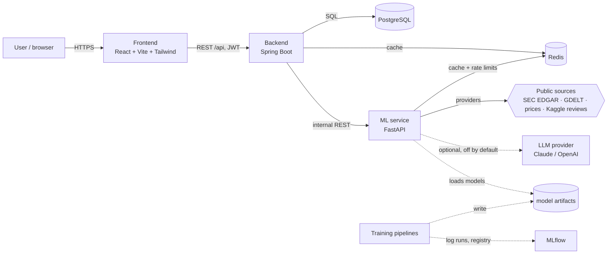
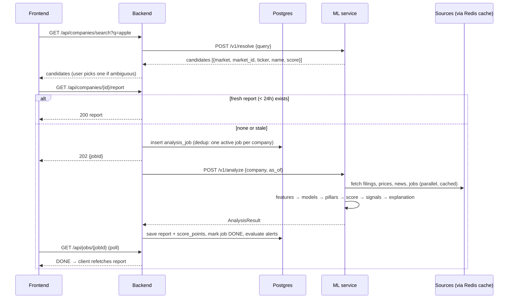

# ECHO — System Architecture

Status: **implemented** (2026-10-05). Decisions D1–D5 are resolved (see BUILD_PLAN.md). Deviations from this
design are noted inline as *As built*.
Companion docs: [DATA_STRATEGY.md](DATA_STRATEGY.md) (sources, licences, demo universe, point-in-time rules),
[ML_PIPELINE.md](ML_PIPELINE.md) (models, features, evaluation, MLOps), [SCORING.md](SCORING.md)
(health score and explainability) and [BUILD_PLAN.md](BUILD_PLAN.md) (roadmap).

---

## 1. Goal and scope

A user types a company name. ECHO resolves it to a real entity, collects public signals,
runs NLP/ML over them, and returns a **Corporate Health Report**: a 0–100 health score built
from five pillars, warning signals, risk indicators, trends, a major-events timeline, and a plain-language
explanation of *why* the score is what it is. Every number links back to its source.

**In scope (v1)**

- Phase 1 market: companies that file with the US SEC (`10-K`/`10-Q`/`8-K`), because SEC XBRL is a
  free, structured, point-in-time financial source. All market-specific code sits behind a
  `MarketProvider` (DATA_STRATEGY §2), so NSE/BSE can be added later without changing the core.
- `DEMO_MODE=true`: a 12-company demo universe (healthy, mixed and historical-distress companies) served from
  **recorded real data** in `data/sample/`, with no API keys and no network. This is the default.
- No paid API is required anywhere. LLM explanations are optional (§8).
- Anonymous search and report viewing; login only for watchlists and alerts.

**Out of scope (v1)**

- Private companies, and non-US markets until their `MarketProvider` exists.
- Investment advice, price targets, buy/sell language. The UI and the explanation layer must
  never produce these.
- Scraping sites whose terms prohibit it (LinkedIn, Glassdoor, Indeed). Employee reviews come from a
  published Kaggle dataset (DATA_STRATEGY §1).
- Claims of certainty. ECHO reports historical and public signals and calibrated estimates, not predictions
  that a company will fail.

---

## 2. System context



| Component | Owns | Does **not** own |
|---|---|---|
| **Frontend** (`frontend/`) | Search, dashboard, charts, "why?" drawers, watchlist UI | Any scoring logic |
| **Backend** (`backend/`) | Users + JWT auth, company registry, analysis jobs, report persistence and history, watchlists, alerts, scheduling, public REST API | Data fetching, ML |
| **ML service** (`ml-service/app/`) | Entity resolution, source adapters, feature computation, model inference, scoring, warning rules, explanation text | Persistence of users and reports (stateless apart from caches) |
| **Training pipelines** (`ml-service/pipelines/`) | Offline: ingestion of training data, feature building, training, evaluation, MLflow logging, exporting artifacts | Anything at request time |
| **PostgreSQL** | System of record for the backend | — |
| **Redis** | Raw source-response cache, per-source rate-limit buckets, short-lived search cache | Anything that must survive a flush |
| **MLflow** | Experiment tracking during training only; not in the request path | — |

**Why split Java and Python this way:** the ML service has to hold the raw text and time series
anyway to run NLP and ML over them, so ingestion lives next to the models. The backend stays a
conventional, testable CRUD + orchestration API. The contract between them is one versioned
JSON document (`AnalysisResult`, §7.3), which keeps the two sides independently testable.

---

## 3. Analysis flow

Analysis takes ~0.5–2 s in demo mode and minutes in live mode (rate-limited sources), so it runs as an async
job on a bounded thread pool; the frontend polls the job.



Failure handling: each adapter returns data **or** a typed "unavailable" result with a reason.
A missing source never fails the job. It lowers that pillar's coverage and the report's
confidence (SCORING.md §3). The job fails only if entity resolution fails or *no* pillar has data.

---

## 4. Data sources

The full list of sources, licences, the demo universe and the point-in-time rules is in [DATA_STRATEGY.md](DATA_STRATEGY.md). In summary:

- **Market-specific** data (identity, financial facts, disclosures, prices) comes through a `MarketProvider`.
  Phase 1 ships `UsSecProvider` (EDGAR submissions + XBRL companyfacts + 8-K items + a pluggable price source).
- **Market-independent** signals come through `NewsSource` (GDELT) and `ReviewSource` (the Kaggle
  Glassdoor dataset now; any licensed source later).
- Every provider returns data **or** a typed `Unavailable(reason)`, plus source URLs and `retrieved_at`.
- `DEMO_MODE=true` swaps each provider for a replay provider over `data/sample/`, which holds data recorded by
  the same providers.
- Redis caches raw responses with a TTL per source, and a token bucket per source enforces rate limits (SEC ≤ 10 req/s
  with a contact `User-Agent`).

---

## 5. ML service internals

```
ml-service/app/
  api/         FastAPI routers: /v1/resolve, /v1/analyze, /v1/sentiment, /v1/models, /health
  schemas/     Pydantic models — AnalysisResult is the contract with the backend
  adapters/    SourceAdapter implementations (+ SampleAdapter for demo mode)
  core/        config, logging, Redis cache, rate limiter, entity resolution
  inference/   loads artifacts once at startup; sentiment, event classifier, anomaly,
               risk model; scoring engine; warning rules; explanation generator
ml-service/pipelines/   offline training — ingestion → cleaning → features → training → evaluation → monitoring
ml-service/models/      model code per family (sentiment, risk, anomaly, forecast, scoring, clustering)
```

Request pipeline inside `/v1/analyze`:

1. **Fetch**: run all providers concurrently (`asyncio.gather`) with a per-source timeout.
2. **Normalise**: map XBRL tags to a canonical statement schema, align time series to daily or
   quarterly frequency, and de-duplicate syndicated news (near-duplicate clustering on
   headline embeddings).
3. **Enrich**: run sentiment on news, classify news and 8-K events into event types, and score anomalies.
4. **Score**: compute factor scores, pillar scores, the composite, confidence and the distress probability
   (SCORING.md).
5. **Signals**: evaluate the warning-signal rules.
6. **Explain**: build the factor attribution, then write the narrative with the LLM or the template (§8).
7. Return an `AnalysisResult` stamped with `model_version` and a `data_as_of` for each source.

Runtime: Python 3.12 in Docker (3.13 locally is fine, but pin 3.12 in the image for ML wheel
compatibility). All models run on CPU. FinBERT is about 110M parameters, so batch-scoring around 200
headlines takes seconds.

---

## 6. Data model (PostgreSQL)

The DDL is in [`V1__init.sql`](../../backend/src/main/resources/db/migration/V1__init.sql) and Flyway applies it.

| Table | Purpose | Notes |
|---|---|---|
| `users` | Accounts | BCrypt hash, role USER/ADMIN |
| `companies` | Company registry, market-agnostic | `UNIQUE (market, market_id)`. `market_id` is the CIK for `US_SEC`. Upserted from resolve results. |
| `company_identifiers` | Tickers, CIK, ISIN, former names, NSE/BSE codes | Validity dates, because tickers get reused and names change |
| `analysis_jobs` | Async analysis jobs | UUID id. A partial unique index allows only one active job per company and as-of date. |
| `reports` | Append-only report snapshots | Scalar columns for querying, plus the full `AnalysisResult` as JSONB |
| `score_points` | Score history series | `PRIMARY KEY (company_id, as_of)` |
| `watchlists`, `watchlist_items` | User watchlists | Per-item score-drop threshold |
| `alerts` | Alert inbox | Linked to the triggering report |

Training data, features and model artifacts are **not** in Postgres. They live in versioned files
(DATA_STRATEGY §4) and in MLflow, so the ML pipeline can be reproduced without a database dump. `payload` is JSONB
so the report schema can evolve without a migration on every change. The backend checks `schema_version`.

---

## 7. API contracts

### 7.1 Public backend API (`/api`, documented with springdoc OpenAPI)

| Method | Path | Auth | Purpose |
|---|---|---|---|
| POST | `/auth/register`, `/auth/login` | — | Returns a JWT |
| GET | `/companies/search?q=` | — | Resolve a name to candidates |
| GET | `/companies/{id}` | — | Company profile |
| GET | `/companies/{id}/report` | — | Latest report, or `202 {jobId}` if one is being generated |
| POST | `/companies/{id}/analyze` | user | Force a refresh, returns `202 {jobId}` (rate-limited per user) |
| GET | `/jobs/{jobId}` | — | Job status |
| GET | `/companies/{id}/history?from=&to=` | — | `score_points` series |
| GET | `/companies/compare?ids=1,2,3` | — | Latest pillar scores side by side (≤4 companies) |
| GET/POST/DELETE | `/watchlists`, `/watchlists/{id}/items` | user | Watchlist CRUD |
| GET / PATCH | `/alerts`, `/alerts/{id}/read` | user | Alert inbox |

Errors use RFC 7807 `application/problem+json`.

### 7.2 Internal ML-service API (reachable only on the Docker network)

| Method | Path | Purpose |
|---|---|---|
| GET | `/health` | Liveness + loaded model versions |
| POST | `/v1/resolve` | `{query, market?}` → ranked `[{market, market_id, ticker, name, former_names, match_score}]` |
| POST | `/v1/analyze` | `{company: {market, market_id}, as_of?: date, include_backfill?: bool}` → `AnalysisResult` |
| POST | `/v1/sentiment` | `{texts: [...]}` → scores (debug / demo of the NLP model) |
| GET | `/v1/models` | Model cards: name, version, metrics vs baseline, data, licences |
| POST | `/v1/explain` | Re-generate the narrative for a stored result with a given provider (admin/debug) |

### 7.3 `AnalysisResult` (abridged)

```json
{
  "schema_version": "1.0",
  "model_version": "echo-0.1.0",
  "company": {"market": "US_SEC", "market_id": "0000320193", "ticker": "AAPL", "name": "Apple Inc.", "sector": "Technology"},
  "case_study": null,
  "as_of": "2026-10-05",
  "data_as_of": {"financials": "2026-08-01", "prices": "2026-10-03", "news": "2026-10-05", "jobs": null},
  "health": {"score": 71, "band": "STRONG", "confidence": 0.78},
  "pillars": [
    {
      "key": "financial", "score": 82, "weight": 0.30, "effective_weight": 0.35, "coverage": 1.0,
      "factors": [
        {"key": "altman_z", "label": "Altman Z-score", "kind": "stat", "value": 4.1, "score": 88,
         "peer_percentile": 0.81, "impact": 3.4, "evidence": ["ev:10k-2025"]}
      ]
    },
    {"key": "workforce", "score": null, "coverage": 0.0, "unavailable_reason": "no public job board"}
  ],
  "distress": {"probability_12m": 0.03, "model": "distress_lgbm@4", "top_drivers": [{"feature": "interest_coverage", "shap": -0.8}]},
  "forecasts": [{"series": "revenue", "model": "forecast_lgbm@2", "horizon": "2026Q4", "p10": 0, "p50": 0, "p90": 0}],
  "employee": {"index": 0.21, "ci90": [0.15, 0.27], "as_of_quarter": "2021Q2", "themes": [{"theme": "management", "share": 0.18}]},
  "signals": [
    {"code": "EXEC_DEPARTURE", "severity": "MEDIUM", "date": "2026-09-12",
     "message": "CFO departure disclosed in 8-K Item 5.02", "evidence": ["ev:8k-0912"]}
  ],
  "events": [
    {"id": "evt-1", "date": "2026-09-12", "type": "LEADERSHIP_CHANGE", "origin": "8-K 5.02",
     "title": "...", "sentiment": -0.4, "evidence": ["ev:8k-0912", "ev:news-77"]}
  ],
  "anomalies": [{"date": "2026-09-13", "series": "volume", "score": 0.94, "note": "volume 4.2x 60-day median"}],
  "timeseries": {"price": [], "news_sentiment": [], "news_volume": [], "open_roles": [], "health": []},
  "evidence": {"ev:8k-0912": {"type": "filing", "title": "Form 8-K", "url": "https://www.sec.gov/...", "date": "2026-09-12"}},
  "models": {"news_sentiment": "3", "distress_lgbm": "4"},
  "summary": {"text": "...", "pillar_notes": {}, "generator": "template", "grounding_check": "passed"},
  "disclaimer": "Observable public signals and model estimates. Not financial advice."
}
```

`impact` is that factor's exact contribution, in points, to the health score relative to a neutral 50.
The impacts sum to `score − 50` (SCORING.md §4), and the "why?" drawers and the explanation layer are built on them.

---

## 8. Explanation layer

ECHO works completely **without any LLM API key**. The narrative sits behind one interface:

```python
class ExplanationProvider(Protocol):
    name: str                                     # "template" | "claude" | "openai"
    def explain(self, result: AnalysisResult) -> Explanation: ...   # summary, pillar_notes, key_risks[evidence_ids]
```

- **`TemplateExplanationProvider` (default, always available).** Deterministic Jinja templates driven by
  the factor impacts (SCORING §4), signals, distress drivers (SHAP) and forecasts. It picks the top positive and negative
  drivers, states coverage gaps, and cites evidence IDs. It is the same input the LLM would get, so its output is
  explainable by construction.
- **`ClaudeExplanationProvider` / `OpenAIExplanationProvider` (optional).** Used only when
  `EXPLANATION_PROVIDER` is set **and** the matching key is present. They receive the structured result only, never
  raw article text as instructions, and return structured JSON.
- **Grounding validator** for any LLM output: every evidence ID exists, every number matches an input number
  (with rounding), and no advice vocabulary is used. If it fails, the system retries once and then uses the template provider.
- The provider used is stored in `summary.generator` and shown as a badge in the UI. LLM output is cached with the report,
  so page views never trigger an API call.

---

## 9. Cross-cutting concerns

| Concern | Approach |
|---|---|
| **Point-in-time correctness** | Every fact is used only after its `filed`/published date, never its period-end date. Backtests and history backfills depend on this. |
| **Security** | BCrypt passwords, short-lived JWT (`JWT_EXPIRATION_MINUTES`), CORS restricted to the frontend origin, ML service not exposed outside the Docker network, secrets only via `.env`, per-user rate limit on `/analyze`. |
| **Reproducibility** | Every report stores `model_version`, source `data_as_of` dates and evidence URLs. Model artifacts are versioned in MLflow. |
| **Observability** | Structured JSON logs with a `job_id` correlation ID across backend → ML service. Spring Actuator + FastAPI `/health`. Per-adapter success and latency counters. |
| **Testing** | ML: pytest unit tests for ratio math and scoring invariants; adapter contract tests against recorded fixtures (no live calls in CI). Backend: JUnit + Testcontainers (Postgres), WireMock for the ML service. Frontend: Vitest for components, one Playwright smoke test over demo mode. |
| **Disclaimer** | Shown on every report page and included in every API payload. |

---

## 10. Deployment (docker-compose, `infra/docker/`)

| Service | Image | Port | Notes |
|---|---|---|---|
| `postgres` | postgres:16 | 5432 | Init scripts in `infra/postgres/` |
| `redis` | redis:7 | 6379 | |
| `ml-service` | python:3.12-slim + app | 8000 (internal) | Model artifacts mounted from `ml-service/artifacts` |
| `backend` | eclipse-temurin:17-jre + jar | 8080 | Runs Flyway on start |
| `frontend` | node:22 build → nginx | 5173 / 80 | |
| `mlflow` | ghcr.io/mlflow/mlflow | 5000 | Tracking + registry. *As built:* SQLite store on the `ml-service/mlruns` volume with proxied artifacts |

`docker compose up` with the default `.env` (DEMO_MODE=true) must give a working demo with no keys.

---

## 11. Key decisions (ADR summary)

| # | Decision | Alternatives considered | Reason |
|---|---|---|---|
| A1 | Composite score is a **transparent weighted formula** over peer-normalised factors, not a black-box model | Train one model to output "health" | There is no ground-truth label for "health". A formula is explainable by construction, and the ML models feed factors into it and are shown alongside it. |
| A2 | Distress-probability model shown **alongside** the score, not inside it in v1 | Make it a pillar | Avoids double-counting Altman-style inputs and keeps the headline number explainable. Disagreement between the two is itself shown. |
| A3 | Ingestion lives in the ML service | Java ingestion, Python only for inference | The text and time series are needed where the models run, which avoids shipping raw data twice. |
| A4 | Report stored as JSONB snapshot | Fully normalised report tables | The schema will churn during the project, and reports are read whole. |
| A5 | US SEC filers first, behind a `MarketProvider` + canonical schemas | Build for India and the US at once | SEC XBRL is the only free, structured, point-in-time source. The abstraction keeps NSE/BSE a plug-in. |
| A6 | Job-board snapshots built by ECHO (optional phase) | Third-party hiring datasets | Free and compliant. The cost is that history starts when tracking starts. |
| A7 | Template explanations by default, LLM optional | Claude-only narrative | No paid dependency. Deterministic and testable. |
| A8 | Demo mode replays recorded real data | Synthetic demo data | Honest demo. Every number traces to a real public source. |
| A9 | Kaggle employee reviews behind `ReviewSource` | Scraping review sites | Legal and reproducible. A licensed source can be swapped in for SaaS. |
