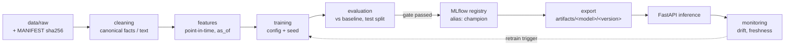

# ECHO — ML Pipeline and MLOps

Status: **implemented** (2026-10-05). Results are in [docs/report/REPORT.md §6](../report/REPORT.md); the
deviations from this design are listed in §9. Data sources and licences are covered in
[DATA_STRATEGY.md](DATA_STRATEGY.md). The health-score formula is in [SCORING.md](SCORING.md).

## 1. Principles

1. **No hardcoded scores.** Every number on the dashboard comes from a trained model or from a documented
   statistical calculation, and each one is labelled as one or the other (§4, "Kind" column).
2. **Every trained model has a baseline**, a held-out test set it never trained on, a leakage-safe split,
   and a model card. A model is promoted only if it beats its baseline (§7.3).
3. **Reproducible from scratch** with one command per model, pinned dependencies, fixed seeds, hashed
   data manifests and saved split IDs.
4. **CPU-first.** Inference runs on CPU in Docker. Transformer fine-tuning is sized to finish on a laptop CPU in
   under about 2 hours, or on a free Colab GPU. The hardware used is recorded in the model card.
5. **No paid LLM.** The ML stack runs entirely on local models. LLM explanations are an optional add-on
   (ARCHITECTURE §8).

---

## 2. Pipeline stages and code layout

```
ml-service/
  pipelines/
    ingestion/    download + record: SEC bulk/API, GDELT, Kaggle, HF datasets → data/raw (+ manifest)
    cleaning/     XBRL tag mapping → canonical facts; text normalisation; de-duplication → data/processed
    features/     point-in-time feature builders (financial ratios, TTM, YoY, market, text aggregates)
    training/     one module per model; reads a YAML config; logs to MLflow
    evaluation/   metrics, baselines, plots, backtests; writes evaluation reports
    monitoring/   drift (PSI), prediction-distribution and data-freshness checks
  models/         model code per family: sentiment, risk, anomaly, forecast, scoring, clustering
  configs/        one YAML per model run (data version, split, hyper-parameters, seed)
  app/            FastAPI inference service; loads exported artifacts at startup
```

Entry point: `python -m pipelines.run <model> --config configs/<model>.yaml`. Each run executes
ingestion (cached) → cleaning → features → training → evaluation → export, in that order.



---

## 3. Datasets

| Dataset | Used for | Split | Notes |
|---|---|---|---|
| SEC `companyfacts.zip` + submissions (all filers, 2009 onward) | Canonical facts, peer statistics, distress features and labels, forecasting | **Time-based** (below) | ~6–8k companies/year |
| twitter-financial-news-sentiment (~12k texts, 3 classes) | Training the news-sentiment model | Its own train/validation; 10% of train held out for early stopping | Commercially usable (MIT, verify L3) |
| Financial PhraseBank (sentences_allagree) | **Evaluation only** of the sentiment model | Test only | Non-commercial licence. ProsusAI/FinBERT was trained on it, so FinBERT is **not** evaluated on it. |
| ECHO headline set (~300–500 GDELT headlines about the demo universe, hand-labelled by two team members) | In-domain evaluation of sentiment and event classes | Test only | Cohen's κ reported. Labelling guide in `docs/`. |
| Kaggle Glassdoor Job Reviews | Employee-review sentiment and topics | Grouped by company (companies in test are never in train) and by time | Subsample for CPU budget (e.g. 150k reviews) |
| Daily prices for the demo universe + sector ETFs | Anomaly detection, market factors | Time-based | Injected anomalies for evaluation |

**Distress-model split** (by 10-K `filed` date): train 2010–2019, validation 2020–2021, test 2022–2024.
Labels need 12 months of future data, so the newest usable test filings are from 2024.

---

## 4. Model catalogue

"Kind" says what powers each number: **ML** is a trained model, **Stat** is a documented statistical
calculation, and **Rule** is a deterministic mapping.

| # | Component | Kind | Approach | Baselines | Primary metric(s) |
|---|---|---|---|---|---|
| M1 | **News sentiment** | ML | Fine-tune DistilRoBERTa-financial (or FinBERT) on twitter-financial-news-sentiment. Score = P(pos) − P(neg). | VADER; TF-IDF + logistic regression; off-the-shelf FinBERT | Macro-F1 on PhraseBank + ECHO headline set |
| M2 | **News event classification** | ML | Bootstrap labels with zero-shot NLI, review them by hand, then train TF-IDF+LR and a fine-tuned DistilRoBERTa | Keyword rules | Per-class P/R, macro-F1 |
| M2b | 8-K event mapping | Rule | Item code → canonical event (`mappings/sec_8k_items.yaml`) | — | Unit tests |
| M3 | **Employee-review sentiment + themes** | ML | (a) Rating/sentiment classifier on `headline + pros + cons`: TF-IDF+LR → fine-tuned DistilBERT. (b) Themes: BERTopic over cons text (pay, management, work-life, layoffs, culture). Aggregated into a company-quarter **Employee Sentiment Index** with a bootstrap CI. | VADER; star rating only | Macro-F1 / MAE on company-held-out test; correlation of the index with the true mean rating |
| M4 | **Peer clustering** | ML | K-means (and a GMM for comparison) on standardised ratios within each sector. k chosen by silhouette. | Sector only | Silhouette; quarter-to-quarter stability (ARI) |
| M5a | **Market anomaly detection** | ML | Isolation Forest on daily vectors (return, |return| z, volume z, news-volume z, sentiment Δ) | Robust MAD z-score | Precision@k / recall on injected anomalies; hit rate on known events |
| M5b | **Financial-statement anomaly** | ML + Stat | Isolation Forest on quarter-over-quarter changes of canonical items within the sector. Beneish M-score is reported alongside. | Beneish M-score alone | Lift on restatement (8-K 4.02) companies vs others |
| M6 | **Fundamentals forecasting** | ML | Next 4 quarters of revenue and operating cash flow. Global LightGBM on lag/seasonal features across companies, with conformal 80% intervals. | Seasonal naive; ETS (statsmodels) per company | MASE, sMAPE, interval coverage (rolling-origin backtest) |
| M6b | Trend direction | Stat | Theil–Sen slope with bootstrap 90% CI. "Rising/falling" only when the CI excludes 0. | OLS | — |
| M7 | **Distress probability (12-month)** | ML | LightGBM on point-in-time accounting features (ratios, trends, M5b scores, events). Isotonic calibration, SHAP drivers. Non-financial companies only (SIC 6000–6999 excluded; banks are covered by SCORING §2.2). | Altman Z″; Ohlson O-score; logistic regression | PR-AUC (primary, rare positives), ROC-AUC, Brier, calibration curve |
| M8 | **Health score** | Stat | Weighted pillars over peer percentiles (SCORING) | — | Backtest AUC of `100 − H`, lead time |
| M8b | Weight calibration | ML | L2 logistic regression of the distress label on the pillar scores. The coefficients are compared with the expert weights. | Expert weights | Validation PR-AUC |

**Distress label (M7):** positive if, within 12 months after the 10-K `filed` date, the company files
8-K Item 1.03 (bankruptcy/receivership) or receives going-concern doubt in a later filing. Drawdown labels are
added only once a price source covering delisted tickers is available. Without one, the model stays
accounting-only, and the report says so.

---

## 5. Feature engineering (point-in-time)

`features.financial.build(company, as_of)` is the single feature builder used by **both** training and
inference, so the two cannot diverge.

| Group | Features |
|---|---|
| Size / profitability | log(assets), net margin TTM, ROA, EBIT/assets, gross margin |
| Liquidity / solvency | current ratio, cash/assets, debt/equity, liabilities/assets, interest coverage, negative-equity flag |
| Cash flow | OCF/liabilities, FCF margin TTM, quarters of negative FCF (of last 4) |
| Growth / trend | revenue YoY, Δ net margin YoY, Δ current ratio, Theil–Sen slope of revenue over 8 quarters |
| Classic scores | Altman Z/Z″ components, Ohlson O components, Piotroski F, Beneish M |
| Events | Decayed counts of canonical events (12 months), going-concern flag, filing lateness (NT 10-K) |
| Peer-relative | Sector percentile of each ratio as of the date |
| Text aggregates | 90-day news sentiment mean/trend, Employee Sentiment Index level/Δ (where available) |

Preprocessing: winsorise at the 1st/99th percentile (thresholds fitted on train only), keep missing values as NaN for
LightGBM, use median imputation plus a missing-indicator for linear models, and wrap everything in a fitted
`sklearn` Pipeline that is saved with the model.

---

## 6. Leakage controls

- Time-based splits for every temporal model. Random splits are used only for the static text datasets.
- Company-grouped splits for reviews, so the model cannot memorise company-specific vocabulary.
- Every row carries `as_of`, and a test asserts `max(filed) ≤ as_of` for all inputs to each feature row.
- Winsorisation thresholds, scalers, peer statistics and calibration are fitted on train/validation only.
- Hyper-parameters are tuned on validation (Optuna, fixed seed, small budget). The test set is used once per
  model version.

---

## 7. MLOps

### 7.1 Tracking
MLflow (Docker service `mlflow`, Postgres-backed). Each model has an experiment, and every run logs its config, git SHA,
data manifest hash, seed, metrics, plots (confusion matrix, PR curve, calibration, SHAP summary)
and the fitted pipeline.

### 7.2 Registry and export
Each model is registered in the MLflow Model Registry with the aliases `champion` and `challenger`. `pipelines.export` copies the
champion to `ml-service/artifacts/<model>/<version>/` with a `model_card.json`:

```json
{"name": "news_sentiment", "version": "3", "mlflow_run_id": "…", "git_sha": "…",
 "data_manifest_sha256": "…", "trained_at": "…", "hardware": "cpu",
 "metrics": {"test_macro_f1": 0.0, "baseline_macro_f1": 0.0},
 "intended_use": "…", "limitations": "…", "licences": {"data": "…", "base_model": "…"}}
```

The inference service loads whatever `artifacts/` contains and does not need MLflow at runtime.
`GET /v1/models` returns the model cards, and the UI shows them on a "Models" page.

### 7.3 Promotion gate (automated, `pipelines.evaluation.gate`)
A challenger becomes champion only if (a) its primary test metric beats the baseline **and** the current
champion by at least a configured margin, (b) no calibration or regression check fails, (c) the model card
is complete, and (d) the inference smoke test passes against the exported artifact.

### 7.4 Monitoring
A scheduled job (weekly, and also on demand) writes `artifacts/monitoring/<date>.json`:
- **input drift**: PSI per feature, live vs training distribution (alert at > 0.2);
- **prediction drift**: distribution of sentiment classes and distress probabilities;
- **data freshness**: age of the latest data per source per company.

These results drive the retraining trigger and are shown in the UI "Models" page.

### 7.5 Reproducibility
- `ml-service/requirements.lock` is pinned. The Docker image uses Python 3.12.
- Seeds are set for `random`, `numpy` and `torch`. Split ID lists are saved under `data/processed/splits/`.
- `MANIFEST.json` records the SHA-256 of every raw input, and runs refuse to start on a mismatch unless `--refresh` is passed.
- `python -m pipelines.run all` rebuilds every model from raw data.

### 7.6 CI (GitHub Actions)
Lint (ruff), unit tests (pytest), a **training smoke test** (each training module runs end to end on
a tiny committed fixture in < 60 s), an `AnalysisResult` schema-contract test, plus backend and frontend
builds and tests.

---

## 8. Evaluation outputs (for the report)

- One results table per model: baseline vs model on the held-out test set.
- Distress model: PR/ROC curves, calibration plot, SHAP global importance, and the comparison against Altman and Ohlson.
- Forecasting: MASE by horizon vs seasonal naive and ETS; interval coverage.
- Health-score backtest (SCORING §7) and the case-study walk-throughs from DATA_STRATEGY §3.
- An error-analysis section with at least one case where ECHO got it wrong.


---

## 9. Implementation notes (as built, 2026-10-05)

| Item | Design | As built and why |
|---|---|---|
| M1 champion | DistilRoBERTa fine-tune | As designed. PhraseBank macro-F1 **0.895**, Twitter test 0.848; served as int8 ONNX (no PyTorch at inference). |
| M2 news events | NLI bootstrap + reviewed labels | **Keyword rules** (Kind = Rule) until a hand-labelled headline set exists; 8-K item mapping (M2b) as designed. |
| M3 reviews | DistilBERT + BERTopic | TF-IDF + LR classifier (macro-F1 0.629 vs VADER 0.447, company-grouped), **NMF** themes with review-specific stop words, bootstrap-CI index (r = 0.91 vs true ratings). 838k reviews; 150k sampled for training. |
| Manual promotion | — | `python -m pipelines.mlops promote <model> <version> --reason ...` for improvements the gate's primary metric cannot see; the reason, author and time are written into the model card (used once: review_sentiment v2, better theme labels at equal macro-F1). |
| M5a market anomaly | IF on price + news vectors | IF on price/volume robust-z vectors (no long news history exists). **Failed the gate** against the max-\|z\| rule (injected PR-AUC 0.41 vs 0.97), so the rule serves as Kind = Stat. |
| M5b statement anomaly | Primary metric: restatement lift | As designed; restatement ROC-AUC 0.70 vs Beneish 0.50 (lift@5% 2.45× vs 1.71×). |
| M6 forecasting | Global LightGBM + conformal | As designed for Revenue and OCF; ~4,000 series, rolling origin. |
| M7 calibration | Isotonic | **Platt**: isotonic's step function created ties and cut PR-AUC 0.123 → 0.103 at equal Brier; v2 (Platt) replaced v1 through the gate. |
| M7 label | 1.03 or going concern | 8-K Item 1.03 only (going-concern text search is future work). |
| Optuna | all models | M7 only (30 trials); other models use small grids. |
| MLflow backend | Postgres | SQLite file store (`ml-service/mlruns`), also served by the Compose MLflow container; artifacts proxied. |
| Retraining jobs | — | Run as subprocesses of the ML service; job state in SQLite so all uvicorn workers see it. |
| Transformer training data size | — | 8,588 train / 955 validation texts; ~10 min/epoch on a 24-core CPU. |
